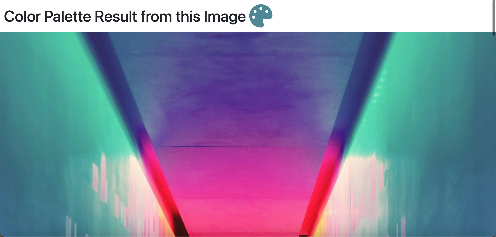
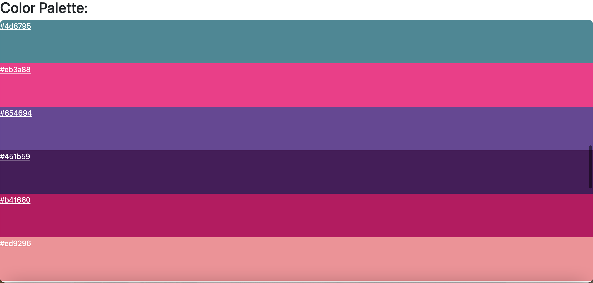

# Flask Color Palette from Picture

## 
### Description
This is a simple flask app to generate a color palette from uploaded picture. It simply reads the image using [Pillow](https://pypi.org/project/pillow/) and use 
[NumPy](https://pypi.org/project/numpy/) and [scikit-learn Kmeans](https://scikit-learn.org/stable/modules/generated/sklearn.cluster.KMeans.html) to manipulate the image and extract the most dominant colors.

### Project motivation
I completed this portfolio website, as one of the assignments in professional [Python 100 Days bootcamp](https://www.udemy.com/course/100-days-of-code/) by [Dr. Angela Yu](https://github.com/angelabauer).

### Quick Start
- Install the requirements in requirements.txt
- Upload the image to the website
- Run Flask app to generate color palette 

[//]: # (- Dynamic version at [Render hosted]&#40;https://portfolio-website-d1x4.onrender.com&#41;)
